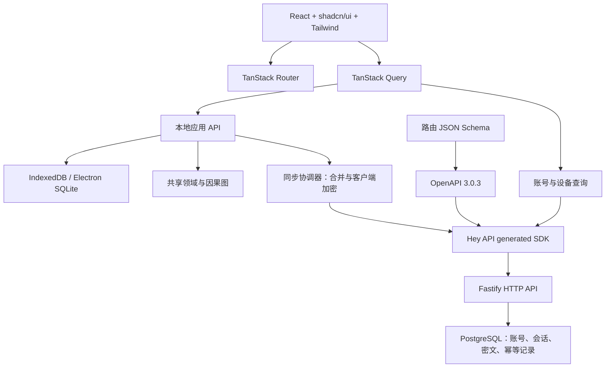

# Luna 前后端整体设计（已批准实施）

> 本文保留 2026-09-08 已批准的 PostgreSQL 原始设计及其实施依据。现行单实例服务端元数据、内置对象存储和本地账本布局以 [09-10 设计](../09-10-sqlite-self-hosted-sync/design.md)为准；现行发布验收以 [D 子任务记录](../09-08-fullstack-release-validation/validation.md)为准。下文的 PostgreSQL 图、表和恢复步骤不得直接当作当前部署说明。

## 1. Architecture and data ownership

用户已认可新增后端及指定前端工具的整体方案：保留现有离线/客户端加密，新增真实的账号和同步 HTTP API。后端不能按商户检索、计算月报或代替用户选择财务冲突。未来需要这些服务端能力时属于独立的架构变更。

品牌统一为 Luna，技术包标识 luna。现有 LunaLedgerApi/window.lunaLedger 是账本接口标识，不是品牌。内部 Ledger/ledger、数据库键和协议标识维持语义及兼容性，不做全局字符串替换；新增页面/包展示名不得使用 LunaLedger 或 lunaledge。



本地事务提交决定“本机已保存”；远端事务提交决定“传输已确认”；因果图合并决定金融状态；Query 是可丢弃的缓存。不存在多套互相覆盖的金融数据源。

## 2. Technology and modules

| Layer | Proposed choice | Responsibility |
|---|---|---|
| UI | React + TypeScript + Vite | 三端共享 SPA，不引入 SSR |
| Components | shadcn/ui，统一 Radix 基础系列 | 项目持有组件源代码，按需引入 Button/Input/Dialog/AlertDialog/Tabs/Select/Skeleton |
| Styling | Tailwind + Vite 插件 + CSS 语义变量 | 保留 Luna 主题，构建本地 CSS |
| Navigation | TanStack Router 代码路由 | 显式路由树，不增加文件路由生成链 |
| Async state | TanStack Query | 查询、提交状态、失效刷新；不是持久化 outbox |
| HTTP contract | JSON Schema + @fastify/swagger + Hey API | 校验、OpenAPI、TS SDK、Query options |
| Server | Node.js 22 兼容版本 + Fastify | 账号、授权、密文、配额、健康检查 |
| Database | PostgreSQL + pg + SQL migrations | 唯一约束、事务、CAS；本期不需 ORM |
| Hosts | Electron / Capacitor | SQLite、原生文件能力，其余复用 UI |
| Delivery | Docker Compose + Nginx | 同源 Web/API 与独立 PostgreSQL |

实施 A0 验证 Node 22/Vite/React/Fastify 插件/Hey API 的兼容组合，锁定具体 patch 和 lockfile。本轮未安装依赖，官网 latest 不等于已验证兼容矩阵。维持根 npm 工程，按浏览器/服务器/Electron 分 tsconfig，不做无必要 monorepo 迁移。

建议目录（尚未实现）：

```text
src/renderer/app/              providers, router, shell, errors
src/renderer/components/ui/    shadcn 基础组件
src/renderer/features/         ledger, entry, budget, settings, account, backup, conflicts
src/renderer/data/             local query keys/options/mutations
src/renderer/styles/           theme.css, globals.css
src/api-client/generated/      Hey API 生成，禁止手改
src/api-client/runtime/        client factory, bounded fetch, error mapping
src/server/app.ts              不监听的 app 工厂
src/server/main.ts             配置、生命周期与监听
src/server/modules/            auth, sessions, ledgers, objects, preferences
src/server/schemas/            HTTP DTO schema，不导出数据库行
src/server/db/                 repositories, SQL migrations, transactions
src/server/cli/                账号工具、迁移、清理
src/shared/                    既有领域、图、加密
src/sync/                      中立协调器、S3/HTTP adapters
src/web/                       IndexedDB、SW、Android 能力
src/main/                      Electron SQLite、IPC、原生能力
contracts/openapi.json
tests/server/                  真实 PostgreSQL 集成测试
tests/contracts/               schema/SDK/运行时一致性
```

UI 不 import pg/Node/AWS SDK；SDK 不 import server；shared 不依赖 React/HTTP；server 不使用 Electron store。Electron renderer 不获得数据库、路径或 main 的远程 token。

## 3. Accounts, authentication and local profiles

第一版为自托管个人账号、多设备、一个活动账本。管理员通过容器内交互工具创建账号/重置密码；不设默认密码、开放注册或邮件服务。用户名规范化后唯一；账本只有 owner，无角色/邀请。

密码使用异步 Node scrypt，随机 16-byte 盐、64-byte 派生值，存储算法版本/N/r/p。建议起点 N=131072、r=8、p=1、maxmem=256MiB；在实际容器测量资源后调整并留证据。密码为 12–128 Unicode codepoints、最多 512 UTF-8 bytes，不 trim/normalize，不记录原值。账号不存在也执行 dummy KDF，统一登录失败响应。KDF 并发最多 2、排队最多 8，超出 429；账号/IP 组合每分钟 5 次、IP 每分钟 30 次，首版单 API 实例。扩实例前改共享限流。

登录返回随机 32-byte opaque bearer token；数据库只保存 SHA-256 摘要。绝对 TTL 12 小时，无 refresh token，账号重置撤销全部会话；设备页面可撤销单一会话。登录密码与账本解密口令完全独立。

Web/Android 认证服务仅在内存持有 token，登录响应不放 Query cache。Electron 认证与 HTTP sync 在 main 运行，只向 UI 暴露安全投影。生成 SDK 每账号会话实例化，不用全局共享 token。首版重启需重新登录/解锁，但本地已有账本仍可离线操作。

Web 使用 Authorization header，不使用自动附带的认证 cookie。生产 HTTPS，开发只允许精确 loopback 例外。CORS 精确匹配 Web/Android 声明的 origin，不使用任意源凭证规则。Electron 通过 main 发请求，不为 renderer 开放任意跨域代理。HTTP 日志禁止记录认证 header、密码、正文和解密口令。

本地 profile 按 legacy-local 或 serverInstanceId/userId 隔离，每 profile 一份活动账本。Web 使用独立 IndexedDB 数据库；Electron 由宿主生成 profile ID/数据库路径，禁止拼接用户路径。服务器 instance ID 稳定存 DB，URL 相同但实例变化需重新绑定，不能误上传。

登录不自动关联旧数据。退出时取消 Query/同步，清除 token/口令/远端缓存；本地副本保留，并可通过本地 profile 选择器离线访问。切账号先处理草稿，关闭旧视图，旧 session generation 的回调不得落到新 profile。账号登录仅保护服务器数据，不宣称保护设备本地明文；远程撤销不能擦除离线副本。

## 4. PostgreSQL model and transactions

| Table | Fields and constraints |
|---|---|
| server_metadata | singleton、immutable instance_id、schema_version |
| users | UUID id、unique normalized username、password hash/salt/params、disabled_at、created_at |
| sessions | id、user_id FK、unique token_hash、device_label、created_at、expires_at、revoked_at |
| ledgers | UUID id、owner_user_id FK UNIQUE（首版一账号一账本）、created_at；名称/币种在密文中 |
| ledger_objects | ledger_id PK/FK、opaque_body bytea、version bigint、etag、sha256、updated_at |
| preference_objects | user_id PK/FK、opaque_body bytea、version bigint、etag、sha256、updated_at |
| idempotency_records | UNIQUE(user_id,operation_scope,key)、request_hash、status/result metadata、expires_at |
| security_events | timestamp、actor opaque ID、action、target ID、result、request_id；无正文/凭证 |

原始 envelope UTF-8 bytes 存 bytea，防止 JSONB 重排影响 hash。后端验证公开 envelope 结构、版本、大小，不能证明解密后图的正确性；客户端继续完整解密/领域校验。

沿用账本限额：12MiB 密文、8MiB 明文、10,000 revisions、100,000 parent links。配置对象沿用现有配置加密模块上限，独立 schema、版本和确认状态。首版不在服务端留每次全量对象副本，图自身保存金融历史，灾备由数据库备份提供。幂等记录至少 24 小时、安全事件 30 天；过期会话定时清理。超限显式报错，不自动裁剪图。

迁移命令持 advisory lock，一次执行；API 不随每次启动竞争迁移。写入和会话/归属检查同一事务，统一锁序 user → session → ledger → object；请求对授权行加共享锁、撤销加排他锁，明确提交先后。撤销先提交则后续写失败；撤销前已提交的写不逆转。

## 5. HTTP / OpenAPI

前缀 /api/v1，路由 JSON Schema 是 HTTP 结构唯一来源，导出 OpenAPI 3.0.3。operationId 固定；每个操作声明 request/success/error/auth/limit。明文领域 DTO 仍由现有 decoder 管理，不为了 Hey API 再造一套金融 schema。

| Method / path | operationId | Contract |
|---|---|---|
| GET /meta | getServerMeta | instanceId、兼容版本、限额，无内部路径 |
| POST /auth/sessions | createSession | username/password/deviceLabel → token/expiresAt/safe user；no-store |
| GET /auth/me | getCurrentUser | 安全账号投影 |
| GET /auth/sessions | listSessions | 本账号会话，最多 100 条 |
| DELETE /auth/sessions/{id} | revokeSession | 撤销本账号指定会话，204，幂等 |
| DELETE /auth/session | logoutSession | 撤销当前会话，204 |
| POST /ledgers | createLedger | 显式创建空间，Idempotency-Key 必填；201，已有时 409 |
| GET /ledgers | listLedgers | 当前账号 0/1 个空间，只含 opaque ID/更新时间 |
| GET /ledgers/{id}/object | getLedgerObject | 原始 envelope JSON + ETag；空间存在但对象为空 404 |
| PUT /ledgers/{id}/object | putLedgerObject | envelope JSON、CAS 条件、Idempotency-Key；200 + ETag |
| GET /preferences/object | getPreferenceObject | 独立配置密文与 ETag |
| PUT /preferences/object | putPreferenceObject | 独立 CAS/限额，不确认账本同步 |
| GET /healthz | getHealth | 进程存活，最小公开响应，路径无 /api/v1 前缀 |
| GET /readyz | getReadiness | DB/schema 就绪，仅内部健康检查 |

首次 PUT 用 If-None-Match: *；更新用 If-Match: opaque ETag。遗漏 428，二者同时提供 400，不匹配 412；没有无条件覆盖。对象归属验证后才能区分空对象与不可访问空间，不能把所有 404 当作可创建。首版同步始终 GET 完整对象，不依赖 HTTP 缓存；/api 响应 no-store。

错误 `{code,requestId,retryable,fieldErrors?}` 不带 stack/SQL/原请求。状态：400 输入错误、401 认证、404 不存在/不可见、409 状态或幂等冲突、412 CAS、413 超限、415 content type、428 缺少条件、429 限流、503 DB 不可用。UI 以本地 i18n code 映射，不显示服务器原始错误字符串。

请求只接收声明的 application/json，拒绝未支持的压缩体；按实际 bytes 计限，不信 Content-Length。代理上限和服务端路由上限一致。给出 Retry-After 和 requestId，CORS 暴露客户端实际需要的 ETag/Retry-After，不开放全部 header。

### CAS and idempotency

PUT 同一事务内完成权限检查、幂等占位、CAS、对象更新、结果记录。幂等 scope 包含账号/方法/目标，request hash 包含原条件头和原始 body hash。同 key 不同 hash 为 409，同 key 同 hash 重放已提交 ETag/状态；唯一约束串行化重复请求，失败事务不能留成功记录。

首次插入由主键竞争只允许一个成功；更新使用 UPDATE ... WHERE version=observedVersion RETURNING 或等价锁，0 行为 412。version bigint 不转 JS number，ETag 是 opaque 字符串。只有 COMMIT 后回复成功。提交后断线以原 key/body/headers 重试；重新合并产生新密文必须换 key。幂等记录过期后旧 CAS 条件仍阻止覆盖，客户端重新下载/合并。

## 6. Hey API and TanStack Query

生成链：无监听 app factory 注册 routes/schemas → 稳定排序 OpenAPI → Hey API TypeScript/SDK/fetch/TanStack Query 插件 → src/api-client/generated。导出不连接生产 DB、不读取生产秘密。产物纳入版本控制，禁止手改。api:check 在临时目录重新生成并比较全部预期文件，不能用 git diff 忽略未跟踪文件后声称一致。

SDK 真实用于账号、空间、同步 HTTP 调用。密文 GET 需 ETag/AbortSignal/原始响应：使用生成调用的完整 response 模式及 runtime bounded-fetch 适配，不将 Response 存 Query cache。A0 必须证明有限字节读取、条件头、幂等头与错误状态可穿过 SDK；否则阻断并调整适配层，不能在组件散落 fetch 绕开。

账号/会话列表用生成 Query options，key 增加 serverInstanceId/userId/session generation。登录、口令、密文传输由专用服务处理，不经过持久化 Query 或 mutation cache。金融 key 示例 `['local',profileId,ledgerId,'snapshot',month]`；settings/conflicts 各自独立。token、金额、notes 不进入 key/devtools。

本地 query/mutation 使用 networkMode: always，避免断网阻塞 IndexedDB/IPC。远端用 online 模式，GET 临时失败最多重试 2 次；401/403/404/412/413 不自动重试。远端写由 sync coordinator 持有幂等和重试上下文，Query mutation retry=false，避免重试嵌套。

本地 mutation 提交成功后 invalidate snapshot/conflicts/status，不乐观计算金融总额。写成功但刷新失败要显示“已保存，刷新失败”，不能重放新增。草稿保存原 revision/budget heads，不因 refetch 替换。合并后的预算影响可能跨月份，需失效全部受影响月并通知其他窗口（BroadcastChannel/宿主事件）。

## 7. Synchronization and conflicts

从 LedgerSyncSession 抽取传输中立会话 target=s3|server、passphrase、session generation；保留 LedgerObjectStore 的 get/put/条件语义。HTTP adapter 把固定对象 key 映射到 ledgerId，不把任意 S3 path 拼进 URL。

步骤：下载密文 → 解密/校验 workspace/graph → 与最新本地图在本地事务合并 → 加密 → 条件上传 → 再次检查本地是否变化 → 确认具体 document。ETag 不是金融版本，时间戳不决定赢家，多 heads 由用户选择。

沿用单任务、60 秒预算、最多 4 次合并尝试；429 尊重 Retry-After 且受总预算限制。状态区分本机已保存/待同步/需登录/需解锁/同步中/已同步/冲突/失败。401 不影响本地已提交数据。取消在下载、解密、提交边界检查；IDB 需要 transaction abort，不能只 await 后检查。

自动同步只在用户明确连接、已登录/解锁的活跃 app 里：本地写后 debounce、恢复网络/前台触发。SW 不持有口令，不承诺关闭 app 后后台同步。S3/server 同时只启用一个目标；配置独立开关、payload、密码和确认状态。

首次连接先 GET：空本地可安装远端图；同 workspace 才 merge；不同 workspace 停止并保留两边，不覆盖。远端无对象才允许首次 CAS。沿用 envelope v1 和现有 PBKDF2/AES-GCM 参数，账号密码不参与账本 KDF。

## 8. Routes and interaction

同一代码路由树，Web browser history，Electron/Android hash history。Nginx 仅对前端导航 fallback，/api 和缺失静态资源不能回 index.html。SW precache 完整静态依赖与懒路由，不缓存金融数据/API；不强制更新覆盖打开的草稿。

| Route | Surface |
|---|---|
| / | 当前本地账本或 /setup |
| /setup | 本地创建，不要求服务器可用 |
| /ledger | 首页，URL search 仅严格校验的 month/type |
| /ledger/menu | 二级菜单，首页背景保持 |
| /ledger/menu/settings | 显示设置 |
| /ledger/menu/budget | 预算 |
| /ledger/menu/statistics | 分类统计 |
| /ledger/menu/sync | server/S3 连接与状态 |
| /ledger/menu/backup | 导入/导出 |
| /ledger/menu/conflicts | 显式冲突选择 |
| /ledger/menu/account | 登录、账号、设备 |

菜单子页共用单一 Dialog shell，不层层堆 modal；直接深链也建立首页背景。记账/编辑和分类 Dialog 为局部受控状态，不把交易 ID/草稿放 URL。category/keyword 筛选保存在内存，month/type 可在 URL。返回保留滚动与筛选。

返回优先分类 → 记账 → 菜单子页 → 首页。无应用内前驱时导航父路径，不直接 history.back 跳出。Android hardware back 进入同一流程。未保存导航通过 Router blocker 询问保留/放弃；beforeunload 仅尽力提示。关闭弹窗恢复原触发点，原节点不存在时聚焦可预测主动作。

## 9. Visual system and UI states

推荐延续 src/renderer/styles.css:1：background #f4f7fb、surface #ffffff、foreground #172033、muted #5b6a80、primary #1e40af、positive #047857、destructive #b42318、border #d8e1ec。映射 shadcn 语义变量，金融正负额另设 token。

16px/1.5 正文、系统/本地字体、4px 间距基准、10px 控件圆角/16px 卡片；窄屏边距 16px、宽屏 24–32px。金额 tabular-nums，Lucide 线性 SVG 与 shadcn 一致。不引入远程字体。375/768/1024/1440px 和横屏审阅，320px 不溢出；触控统一至少 48px（满足现有 44px 下限）。减弱动画、汇总卡稳定几何，不新增暗色切换。

主要组件：LedgerHome、SummaryCards、TransactionList、TransactionDialog、CategoryDialog、SecondaryMenuDialog、BudgetEditor、ConflictInbox、BackupPanel、SyncPanel、AccountPanel。基础组件负责语义与交互，feature 层负责金融规则/状态。表单不因 Query refetch remount。

research/uupm-design-system.md 是原始工具建议。只采纳可访问名称、焦点、触控、响应式和减弱动画；其中 Newsletter 布局、暗底、Google Fonts 不适合本项目，不采纳。“WCAG AAA”推荐标签不是已测试结论。

| State | Required behavior |
|---|---|
| 初始化/无账本 | Skeleton、本地创建；不用登录墙挡住旧数据 |
| 空流水/空筛选 | 分别提示新增/清除筛选 |
| 存储损坏/不可用 | 恢复入口、保留原数据，不伪装新用户 |
| 保存中/失败/提交后刷新失败 | 禁重复提交，保留草稿，明确区分持久化和读取 |
| 断网/未登录/未解锁 | 说明同步原因，本地仍可记账 |
| 新设备 | 登录、解锁、取回已有账本，不用空账本覆盖 |
| 并发冲突 | 候选、总额影响、原 expected heads |
| 口令错/密文损坏/超限 | 不改本地图，提供恢复路径 |
| 切账号/撤销 | 清远端状态，说明本地副本保留 |
| 未保存导航 | 明确保留/放弃，不静默丢稿 |

Tailwind 外部 stylesheet 保持 Web 开发 CSP。A0 验证 Radix runtime style 与 CSP；不能用 script-src unsafe-inline 解决样式问题。若必须支持 style attribute，记录最窄 style-src-attr 策略、兼容证据，再审阅；脚本策略独立。

## 10. Migration and rollback

记录当前工作区基线路径/哈希，不自动提交/reset。先导出并验证加密备份，复制旧库建立 profile；原库不删除、不覆写。升级事务提交后 reopen，验证图及汇总一致才标记成功。

四个入口：旧 Web IndexedDB、旧 Electron SQLite、既有加密备份、S3。全部经原 decoder 获得 LedgerDocument，保留 workspace/revision ID/parents/tombstones/预算，不导成平面流水后重新创建。

绑定：登录 → 明确选择本地账本及服务器 → 口令 → 创建/读取远端空间 → 下载/核对 → CAS 上传 → 回读/解密确认 → 原子记本地 binding。binding 只存 serverInstanceId/userId/ledgerId/provider，无 token/密码。失败保留原 profile/pending，重复操作不重复创建空间。

切 S3 先同步旧目标/备份，停止旧 transport 再连接 server。旧目标不可达时明确无法确认最新状态；若用户选择仅迁移当前本地副本，记录此选择，不能假设旧远端没有更新。

回滚可停止新后端并继续本地。旧版本用原 profile；新产生的记录需先导出兼容加密图再导回受支持旧版，不能宣称切回旧库就包含新数据。server schema 用 expand/contract；升级前 pg_dump，在独立环境恢复演练。恢复后客户端弃旧 ETag/ack，重新取回合并；本地图可补较新历史，不能恢复已经遗失且未同步的设备记录。

## 11. Deployment and operations

Compose web/api/db；Nginx 同源转发 /api，DB 不映射宿主端口，API 仅内部可达，Web 默认 loopback；公网用 HTTPS 反代。LAN 开发地址不作为生产授权。Web 镜像不带服务器/pg，API 镜像不带 Electron 包；显式构建 COPY，拆 tsconfig/output。

配置包含 PUBLIC_ORIGIN、native origins、DB secret file、请求上限、TTL、日志级别；示例只放占位符。instanceId 存 DB 随备份，不随重建改变。域名、证书和机器容量属于部署参数，不阻塞架构设计。

首版单 API 实例；连接池、KDF、上传并发有界。graceful shutdown/readiness/超时/DB 恢复必须测试。日志只记录 requestId、route pattern、status、duration、bytes、opaque IDs；监控 5xx/412/429、DB 延迟、对象容量、备份年龄。

备份包含 PostgreSQL、instance ID 与部署配置，推荐每日/至少 7 个日备份，凭据与备份分存。独立恢复验证登录/ETag/两客户端同步；服务健康不等于客户端可解密。无自动生产部署。

## 12. Risks and approval boundary

- 已确认后端密文同步；明文金融 CRUD 为范围外架构，不能在实施阶段混用。
- 登录密码重置不能恢复账本口令；依赖已解锁副本/已知口令备份。本地数据仍需设备保护。
- 全量图/KDF 存在体积/性能上限，超限显式失败，增量和压缩为后续协议任务。
- A0 阻断技术检查：生成 SDK 的 CAS/幂等/有界响应能力；React/shadcn/CSP 与三端兼容。
- 视觉、原生文件、系统返回、读屏及实际部署需人工审阅，不将模拟器当真机证明。

产品基线、Luna 命名及最新最终摘要已获用户批准实施。实施顺序与验收见 implement.md。版本兼容、SDK/CSP 原型仍按 A0 技术门验证，不能把设计当作已完成验证。
